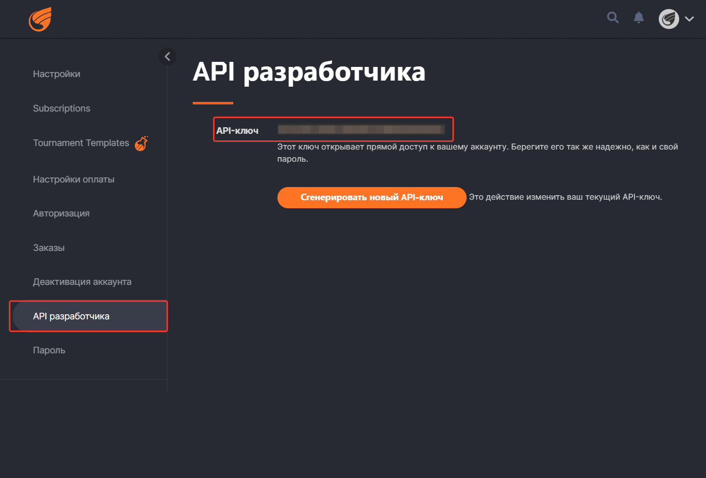

# Пулька Гандикап
Приложение для расчета времени для турниров по пуле на Tkinter
Работает для Windows 10. Установщик можно скачать из папки *./exe*. 

В качестве данных для входа используется:
* логин с сайта challonge

* API ключ
  
* код турнира
   


## Описание кода проекта
Для сборки необходимо установить библиотеку challonge при помощи команды:
```pip install challonge```
### main.py
Главный файл, который запускает окно с программой
### style.py
   Файл со стилями для элементов Tkinter
### get_info_from_challonge.py
   Файл, который содержит функцию, которая обращается к API Challonge и возвращает словари партий и участников
### config.py
   Файл для глобальных переменных
### login_page.py
   Файл с разметкой страницы входа
   
### tournament_page.py
   Файл со страницей турнира. Также содержит в себе функции расчета гандикапа по рейтингу и обработчик нажатия на кнопку "Обновить"
   

